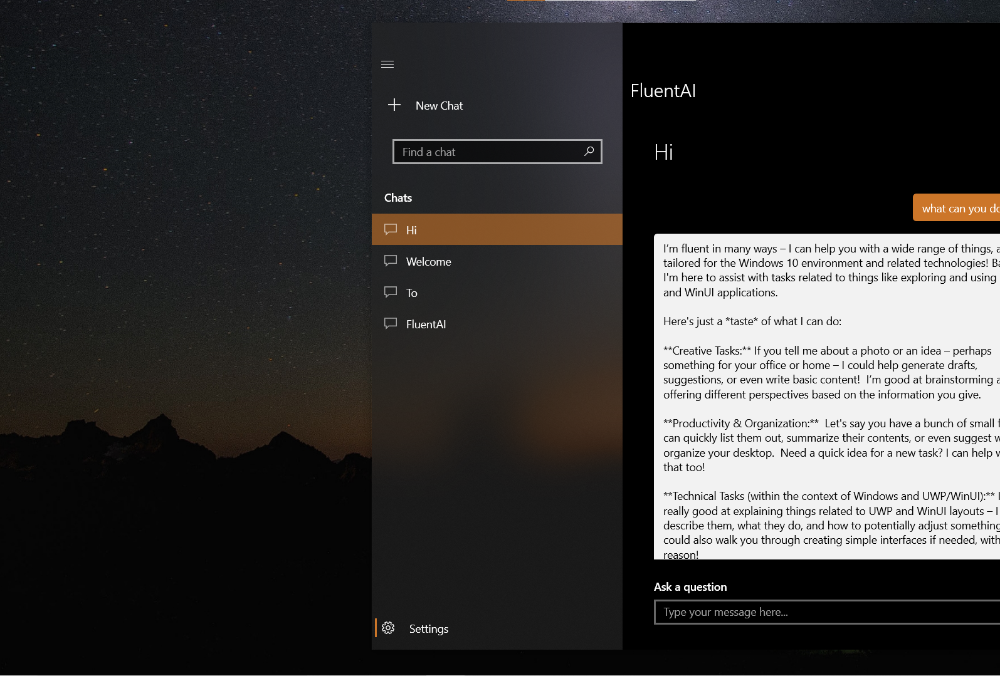
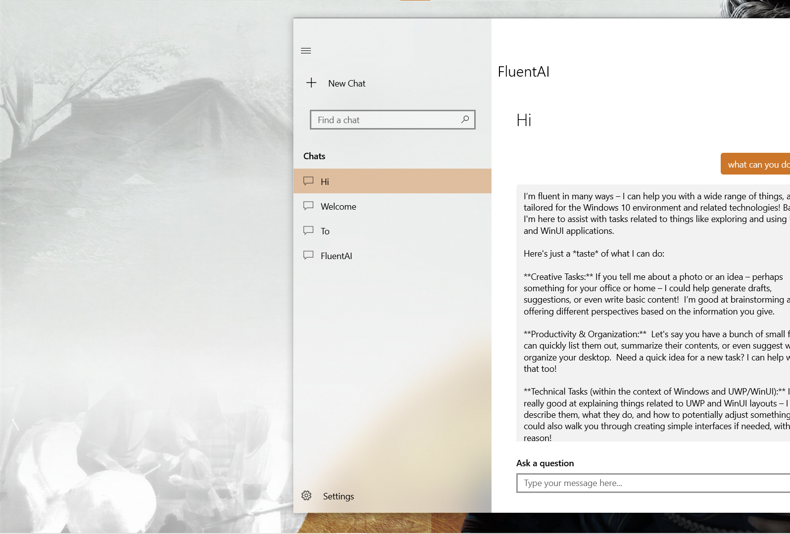

# Project FluentAI
<p align="center">
  
  
</p>
Overview

Project FluentAI is a Universal Windows Platform (UWP) application designed to provide a modern, responsive AI assistant experience on Windows 10 and 11. It integrates with both Google Gemini and local Ollama models, offering a flexible and powerful conversational AI interface. The application features a clean, Windows 10-inspired user interface, robust conversation management, and customizable settings for AI model selection and application theme.

## Features

*   **Intelligent AI Chat**: Engage in conversations with AI models, powered by either Google Gemini (via API) or local Ollama instances.
*   **Conversation Management**: Create, rename, pin, and delete chat conversations, allowing for organized and persistent interactions.
*   **Search Functionality**: Easily find specific conversations using a built-in search feature.
*   **Theming Options**: Personalize the application's appearance with Light, Dark, or System theme settings.
*   **Responsive User Interface**: The UI adapts seamlessly to different window sizes, providing an optimal experience on various devices.
*   **Message Actions**: Copy or delete individual messages within a conversation using context menus.
*   **Customizable AI Backend**: Switch between Gemini and Ollama models, and configure API keys and local model names directly within the application settings.

## Technologies Used

*   **Universal Windows Platform (UWP)**: The framework for building modern Windows applications.
*   **C#**: The primary programming language for the application logic.
*   **XAML**: Used for defining the application's user interface.
*   **.NET**: The underlying framework for application development.
*   **MVVM (Model-View-ViewModel)**: Architectural pattern used for clear separation of concerns.
*   **Newtonsoft.Json**: A popular JSON framework for .NET, used for serializing and deserializing AI model requests and responses.

## Architecture

The application follows the MVVM architectural pattern, promoting a clean separation between the UI (Views), application logic (ViewModels), and data (Models).

*   **Views**: XAML pages like `ChatPage.xaml` and `SettingsPage.xaml` define the visual structure and layout.
*   **ViewModels**: Classes like `MainViewModel.cs` handle the application's business logic, data manipulation, and interaction with AI services. They expose data and commands to the Views.
*   **Models**: Simple C# classes such as `ChatItem.cs` and `Message.cs` represent the data structures used within the application.

## Prerequisites

To build and run Project FluentAI, you will need:

*   **Windows 10 or 11**: The application targets UWP, requiring a compatible Windows operating system.
*   **Visual Studio**: Recommended for development, specifically Visual Studio 2019 or newer with the "Universal Windows Platform development" workload installed.
*   **.NET SDK**: Compatible with the project's target framework.
*   **Ollama (Optional)**: If you plan to use local AI models, you will need to have an Ollama server running locally with the desired models installed (e.g., `qwen3:8b`).
*   **Google Gemini API Key (Optional)**: If you plan to use the Gemini API, you will need an API key from the Google AI Studio.

## Installation and Setup

1.  **Clone the repository**:
    ```bash
    git clone https://github.com/anasaljboorr/FluentAI-UWP.git
    cd FluentAI-UWP-main
    ```
2.  **Open in Visual Studio**:
    Open the `Project FluentAI.sln` file in Visual Studio.
3.  **Restore NuGet Packages**:
    Visual Studio should automatically restore the necessary NuGet packages (`Microsoft.NETCore.UniversalWindowsPlatform` and `Newtonsoft.Json`). If not, right-click on the solution in Solution Explorer and select "Restore NuGet Packages."
4.  **Build the Project**:
    Build the solution (Build > Build Solution) to ensure all dependencies are resolved and the project compiles successfully.
5.  **Run the Application**:
    Select the desired target (e.g., "Local Machine") and run the application from Visual Studio.

## Configuration

Upon launching the application, navigate to the **Settings** page to configure your AI models and theme:

*   **App Theme**: Choose between Light, Dark, or System default.
*   **Use Local Models (Ollama)**: Toggle this switch to enable or disable local Ollama integration. If enabled, specify the `Ollama Model Name` (e.g., `qwen3:8b`).
*   **Use Gemini API**: Toggle this switch to enable or disable Google Gemini integration. If enabled, provide your `Gemini API Key`.

## Contributing

Contributions are welcome! Please feel free to fork the repository, make your changes, and submit a pull request. For major changes, please open an issue first to discuss what you would like to change.

## License

This project is licensed under the MIT License - see the [LICENSE](LICENSE) file for details.

## Acknowledgements

*   Developed by Xiefn Yu (github.com/anasaljboorr)
*   Inspired by modern Windows UI/UX principles.
